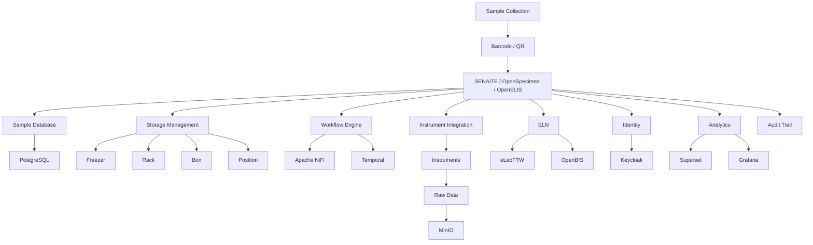
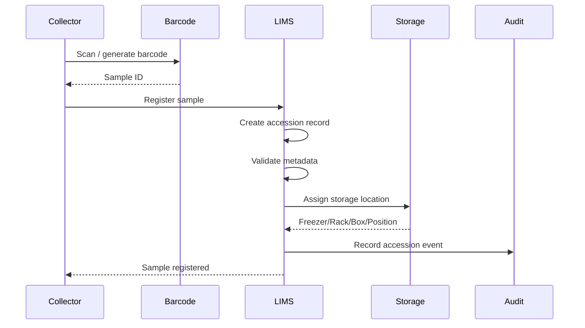
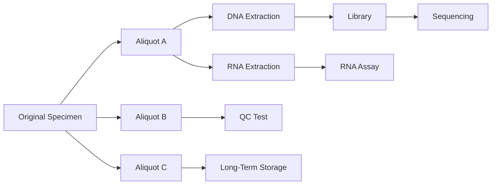
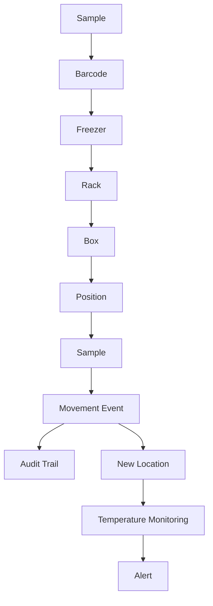
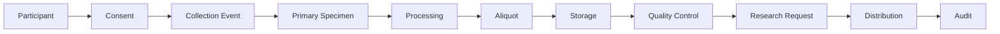
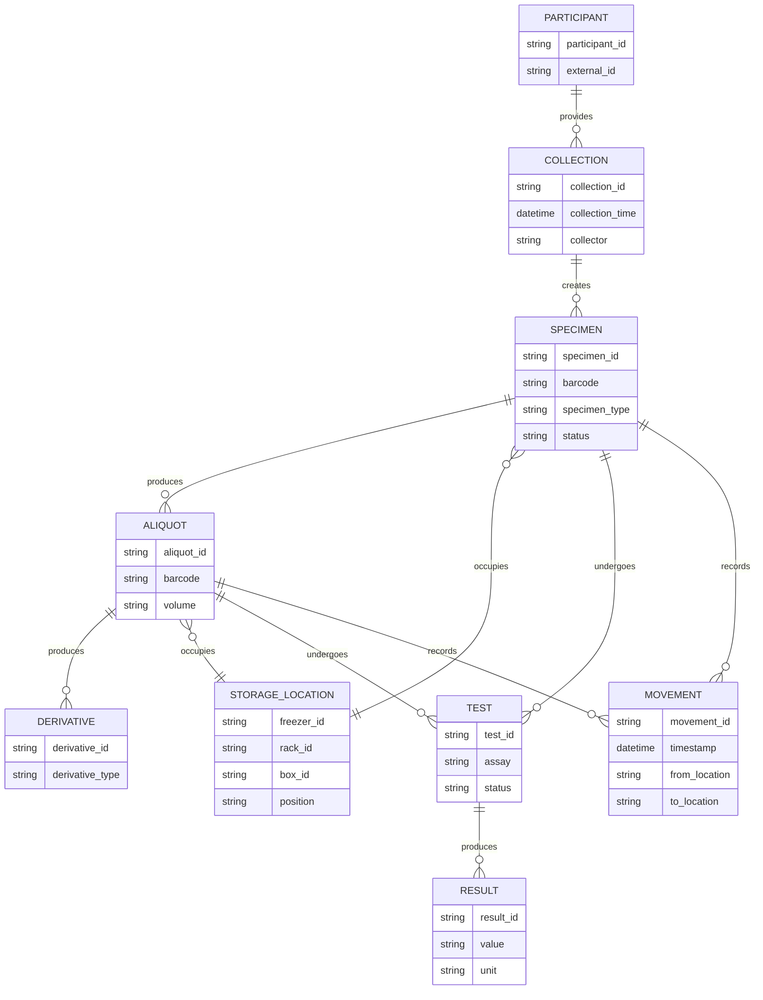
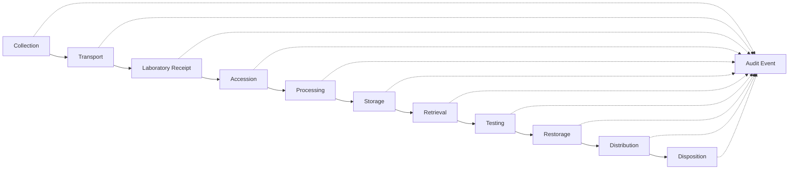
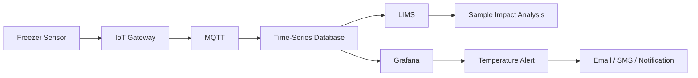
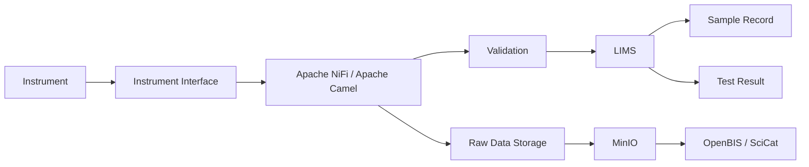

# Awesome-Sample-Tracking-Platform

## Top Sample Tracking Platforms


A curated **GitHub-style reference list of laboratory Sample Tracking, LIMS, Biobanking and Laboratory Inventory platforms**, covering commercial SaaS/hosted products and open-source/self-hosted alternatives.


The primary emphasis is on **open-source software that can be self-hosted**, while keeping commercial SaaS/hosted platforms in a separate section.


Modern sample-tracking platforms typically cover:


* Sample accessioning

* Specimen registration

* Barcode / QR-code identification

* Parent-child sample lineage

* Aliquot management

* Sample splitting and derivation

* Freezer / refrigerator / cryostorage tracking

* Rack / box / position management

* Sample movement history

* Chain of custody

* Sample status and lifecycle

* Storage-location hierarchy

* Study / project association

* Test / assay tracking

* Results management

* Instrument integration

* Electronic laboratory notebooks

* Inventory management

* Reagent / consumable tracking

* Quality control

* Audit trails

* User / role management

* API access

* Import / export

* Reporting

* Workflow automation

* LIMS / ELN integration

* Biobank management

* Research-data management


> **Important:** "Sample Tracking" is broader than simply maintaining a spreadsheet of specimens. Enterprise systems combine physical sample identity, storage location, lineage, workflows, results, audit history and often instrument or inventory integration. Open-source systems vary considerably in their coverage of these areas.


---


## Table of Contents


* [SaaS/Hosted Platforms](#saashosted-platforms)

* [Open-Source](#open-source)


  * [Full LIMS / Sample Tracking Platforms](#full-lims--sample-tracking-platforms)

  * [Biobank / Specimen Management](#biobank--specimen-management)

  * [Laboratory Inventory & Research Management](#laboratory-inventory--research-management)

  * [Electronic Lab Notebook + Sample Tracking](#electronic-lab-notebook--sample-tracking)

  * [Laboratory Workflow / LIMS Building Blocks](#laboratory-workflow--lims-building-blocks)

  * [Barcode / QR / Identification](#barcode--qr--identification)

  * [Storage & Database Infrastructure](#storage--database-infrastructure)

  * [Identity & Access Management](#identity--access-management)

  * [Analytics & Reporting](#analytics--reporting)

* [Commercial → Open-Source Mapping](#commercial--open-source-mapping)

* [Reference Architecture](#reference-architecture)

* [Sample Accessioning Workflow](#sample-accessioning-workflow)

* [Sample Lineage Workflow](#sample-lineage-workflow)

* [Freezer / Cryostorage Workflow](#freezer--cryostorage-workflow)

* [Biobank Workflow](#biobank-workflow)

* [Capability Matrix](#capability-matrix)

* [Recommended Open-Source Stacks](#recommended-open-source-stacks)

* [Best Open-Source Choices by Requirement](#best-open-source-choices-by-requirement)

* [What Open Source Can and Cannot Replace](#what-open-source-can-and-cannot-replace)

* [Why Open Source Is Attractive](#why-open-source-is-attractive)

* [Sample Data Model](#sample-data-model)

* [Security & Compliance Considerations](#security--compliance-considerations)

* [Important Licensing Considerations](#important-licensing-considerations)

* [Conclusion](#conclusion)

* [Contributing](#contributing)

* [Disclaimer](#disclaimer)


---


# SaaS/Hosted Platforms


These are **commercial platforms** and are deliberately kept separate from the open-source ecosystem.


| Platform                                                     | Primary Focus                          | Typical Strengths                                                                 |

| ------------------------------------------------------------ | -------------------------------------- | --------------------------------------------------------------------------------- |

| [Benchling](https://www.benchling.com/)                      | R&D platform / ELN / sample management | Research workflows, molecular biology, inventory, samples, data and collaboration |

| [Labguru](https://www.labguru.com/)                          | Research management / LIMS             | Samples, inventory, ELN, protocols, freezer management, research workflows        |

| [FreezerPro](https://www.ruro.com/freezerpro/)               | Sample / freezer management            | Cryostorage, sample inventory, barcodes, locations and tracking                   |

| [OpenSpecimen](https://www.openspecimen.org/)                | Biobank / specimen management          | Biospecimens, collections, consent, storage, distribution and APIs                |

| [LabCollector](https://www.labcollector.com/)                | LIMS / lab inventory                   | Sample tracking, inventory, freezer management, equipment and workflows           |

| [eLabNext](https://www.elabnext.com/)                        | ELN / LIMS                             | Sample management, inventory, workflows, ELN and integrations                     |

| [CloudLIMS](https://cloudlims.com/)                          | Cloud LIMS                             | Sample lifecycle, tests, workflows, inventory, reporting and compliance           |

| [Quartzy](https://www.quartzy.com/)                          | Lab management                         | Inventory, purchasing, supplies, sample/research operations                       |

| [QBench](https://qbench.com/)                                | LIMS                                   | Sample management, workflows, results, reporting and lab operations               |

| [LabVantage](https://www.labvantage.com/)                    | Enterprise LIMS                        | Sample management, workflows, instruments, quality and analytics                  |

| [STARLIMS](https://www.starlims.com/)                        | Enterprise LIMS                        | Laboratory workflows, sample management, instruments, quality                     |

| [LabWare LIMS](https://www.labware.com/)                     | Enterprise LIMS                        | Sample lifecycle, laboratory workflows, instruments and compliance                |

| [Scispot](https://www.scispot.com/)                          | Life-science data platform             | Samples, inventory, workflows, integrations and research data                     |

| [Labii](https://www.labii.com/)                              | LIMS / ELN                             | Sample management, inventory, ELN and workflow automation                         |

| [eLabFTW Cloud](https://www.elabftw.net/)                    | ELN / lab management                   | Experiments, resources, database records and collaboration                        |

| [SciNote](https://www.scinote.net/)                          | ELN / LIMS                             | Experiments, samples, protocols, inventory and collaboration                      |

| [LabKey](https://www.labkey.com/)                            | Research data / LIMS                   | Biospecimens, laboratory data, studies and data integration                       |

| [Sapio Sciences](https://www.sapiosciences.com/)             | LIMS / ELN                             | Sample management, lab workflows, instruments and research                        |

| [Clinisys](https://www.clinisys.com/)                        | Laboratory informatics                 | Clinical and scientific laboratory workflows                                      |

| [STARLIMS](https://www.starlims.com/)                        | Enterprise LIMS                        | Sample, result, instrument and quality management                                 |

| [Thermo Fisher SampleManager](https://www.thermofisher.com/) | Enterprise LIMS                        | Sample lifecycle, laboratory operations and enterprise integration                |


---


# Commercial Platform Categories


```text

Research / R&D

├── Benchling

├── Labguru

├── eLabNext

├── SciNote

└── Scispot


Biobank / Specimen Management

├── OpenSpecimen

├── FreezerPro

├── LabKey

└── LabCollector


Enterprise LIMS

├── LabVantage

├── LabWare

├── STARLIMS

├── QBench

├── CloudLIMS

└── Sapio Sciences


Laboratory Inventory

├── Quartzy

├── LabCollector

├── Labguru

└── Benchling

```


---


# Open-Source


The open-source ecosystem is considerably more fragmented than the commercial LIMS market.


A complete sample-tracking platform can often be assembled from:


```text

Full LIMS

    +

Biobank / Specimen Management

    +

ELN

    +

Inventory

    +

Barcode

    +

Database

    +

Object Storage

    +

Identity

    +

Analytics

```


Several open-source LIMS platforms provide genuine sample tracking, while others are better understood as **research-data, ELN, biobank or laboratory-infrastructure building blocks**.


---


# Full LIMS / Sample Tracking Platforms


# 1. SENAITE


https://github.com/senaite/senaite.lims


https://www.senaite.com/


**SENAITE is one of the strongest open-source LIMS candidates for sample tracking and laboratory workflows.**


It is built on the Plone ecosystem and supports sample management, analysis workflows, results, reports, storage and laboratory operations.


The current Bika LIMS distribution is built on the SENAITE core and includes components for sample storage, instrument interfaces, bulk sample import, sample-point locations, time-series results and certificates of analysis.


### Features


* Sample registration

* Sample accessioning

* Sample lifecycle

* Sample storage

* Analysis requests

* Results

* Worksheets

* Instrument interfaces

* Quality control

* Reference samples

* Certificates of analysis

* Bulk sample import

* Storage locations

* Sample-point management

* Reporting

* APIs

* Workflow management


### Best for


```text

Laboratory Sample Tracking

        +

Analytical LIMS

        +

QC

        +

Instrument Integration

```


---


# 2. Bika LIMS / Ingwe


https://github.com/bikalims/bika.lims


https://www.bikalims.org/


Bika LIMS is an open-source LIMS ecosystem built around SENAITE.


The current Ingwe Bika LIMS distribution explicitly includes SENAITE core components plus sample storage, sample import, sample-point locations, time-series results, reference-sample management, instrument interfaces and reporting.


### Features


* Sample tracking

* Sample storage

* Sample import

* Analytical workflows

* Instrument interfaces

* QC

* Reference samples

* COA generation

* Reporting

* Time-series results

* Sample locations


### Important


The current `bikalims/bika.lims` repository is primarily a **Docker packaging/distribution and collection of Bika/SENAITE components**, while the application source lives in the underlying repositories.


### Best for


```text

Bika/SENAITE

    +

Food Testing

    +

Environmental Testing

    +

Chemistry

    +

Microbiology

```


Bika's own project documentation describes it as FOSS and emphasizes sample workflows, analytical specifications and laboratory testing.


---


# 3. OpenELIS Global


https://github.com/openelisglobal/openelisglobal


https://openelis-global.org/


OpenELIS Global is an open-source laboratory information system designed especially for public-health and clinical laboratory environments.


### Features


* Patient/specimen registration

* Sample accessioning

* Sample tracking

* Tests

* Results

* Workflows

* Quality management

* Laboratory reporting

* Barcode support

* Instrument integration

* User management

* Audit capabilities

* Interoperability


### Best for


```text

Clinical / Public Health Laboratory

        +

Specimen Tracking

        +

Results Management

```


---


# 4. LabKey


https://github.com/

https://www.labkey.com/


LabKey is an open platform for scientific data management, laboratory data integration and research workflows.


### Useful for


* Sample/specimen data

* Study management

* Assays

* Research data

* Biobank workflows

* Data integration

* APIs

* Data lineage

* Security

* Reporting


### Best for


```text

Research Data

+

Biospecimens

+

Assays

+

Data Integration

```


> LabKey is particularly valuable when the requirement is broader than freezer inventory and includes **scientific data management**.


---


# 5. eLabFTW


https://github.com/elabftw/elabftw


https://www.elabftw.net/


Open-source electronic laboratory notebook and research-management platform.


### Features


* Experiments

* Resources

* Custom fields

* Attachments

* Templates

* Inventory/resource management

* User groups

* Permissions

* Database-like records

* API

* Audit/history

* Collaboration


### Best for


```text

ELN

+

Research Sample Metadata

+

Inventory

```


eLabFTW is not a direct replacement for a sophisticated enterprise freezer/LIMS platform, but it is an excellent open-source laboratory-management building block.


---


# 6. MetaLIMS


https://github.com/MetaLIMS/MetaLIMS


Open-source LIMS project intended for laboratory sample and workflow management.


### Useful for


* Sample registration

* Workflow management

* Laboratory data

* Results

* Inventory

* Research workflows


---


# 7. MendeLIMS


https://github.com/arsene-sabot/MendeLIMS


Open-source LIMS project oriented toward laboratory sample and experimental workflows.


### Useful for


* Sample management

* Laboratory workflows

* Research

* Experimental data

* Tracking


---


# 8. GNU LIMS


https://github.com/occhiolino/GNU-LIMS


Open-source LIMS project aimed at laboratory information management.


### Useful for


* Samples

* Laboratory records

* Results

* Basic LIMS workflows


---


# 9. Baobab LIMS


https://github.com/baobab-lims/baobab-lims


Open-source LIMS/biobank-oriented project.


### Best for


* Biospecimens

* Biobank workflows

* Sample metadata

* Storage

* Research laboratories


Open-source LIMS comparisons identify Baobab among the projects covering specimen/sample tracking and biobank-style workflows.


---


# 10. LIMBU / LImBuS


https://github.com/LIMBUS-LIMS


Open-source laboratory information-management projects oriented toward sample and laboratory workflow management.


### Useful for


* Sample records

* Laboratory workflows

* Results

* Research laboratories


---


# 11. ERPNext Healthcare / Laboratory Extensions


https://github.com/frappe/erpnext


ERPNext is not a dedicated LIMS, but its modular architecture can be extended for:


* Healthcare

* Laboratory workflows

* Inventory

* Batch management

* Serial numbers

* Stock movement

* Purchasing

* Suppliers

* Customers

* Accounting


### Best for


Organizations wanting to combine:


```text

Laboratory

+

Inventory

+

Procurement

+

ERP

```


---


# 12. Odoo + OCA Laboratory Extensions


https://github.com/odoo/odoo


https://github.com/OCA


Odoo is not a dedicated sample-tracking platform, but its:


* Inventory

* Lots/batches

* Barcode

* Purchasing

* Manufacturing

* Quality

* Accounting


can provide infrastructure around laboratory operations.


### Best for


```text

Lab Operations

+

Inventory

+

Procurement

+

ERP

```


---


# Biobank / Specimen Management


# 13. OpenSpecimen


https://github.com/openspecimen


https://www.openspecimen.org/


OpenSpecimen is one of the most significant open-source projects in the **biobank and biospecimen-management** category.


### Features


* Biospecimen collection

* Specimen processing

* Specimen distribution

* Consent

* Collection protocols

* Storage containers

* Storage locations

* Aliquots

* Derivatives

* Parent-child specimen relationships

* Barcoding

* Query

* Reports

* APIs

* User management

* Auditing

* Institutional workflows


### Best for


```text

Biobank

+

Biospecimen Tracking

+

Collection

+

Processing

+

Distribution

```


---


# 14. LabKey Biobanking / Biorepository


https://www.labkey.com/


LabKey provides an open platform for scientific and clinical research data, including biospecimen-oriented workflows.


### Useful for


* Specimen metadata

* Study management

* Assays

* Research data

* Biorepository workflows

* Data integration


---


# 15. Baobab LIMS


https://github.com/baobab-lims/baobab-lims


Particularly interesting for organizations requiring:


* Biobank management

* Biospecimen tracking

* Sample metadata

* Storage

* Research workflows


---


# 16. OpenSpecimen Extensions / Integrations


OpenSpecimen can also serve as the **specimen-management layer** while other open-source systems handle:


```text

OpenSpecimen

      │

      ├── Identity

      ├── Storage

      ├── Analytics

      ├── ELN

      └── Laboratory Data

```


This is often more realistic than trying to force one project to perform every LIMS function.


---


# Laboratory Inventory & Research Management


# 17. eLabFTW


https://github.com/elabftw/elabftw


Useful for:


* Laboratory resources

* Consumables

* Research objects

* Experiments

* Metadata

* Attachments

* Documentation


---


# 18. Quartzy-like Open-Source Architecture


There is no single dominant open-source project that completely reproduces Quartzy's combination of:


```text

Inventory

+

Purchasing

+

Lab Supplies

+

Research Operations

```


A practical open-source alternative can combine:


```text

eLabFTW

+

ERPNext / Odoo

+

SENAITE

+

Barcode system

```


---


# 19. OpenBoxes


https://github.com/openboxes/openboxes


OpenBoxes is an open-source inventory and supply-chain management system.


### Useful for


* Inventory

* Stock movements

* Locations

* Lots

* Batches

* Expiration dates

* Warehouses

* Supply-chain workflows


### Best for


Laboratory organizations needing strong inventory infrastructure around their LIMS.


---


# 20. PartKeepr


https://github.com/PartKeepr/PartKeepr


Open-source inventory management system originally designed for electronic components.


Although not laboratory-specific, its concepts can be useful for:


* Inventory

* Part numbers

* Locations

* Stock

* Suppliers


---


# 21. Grocy


https://github.com/grocy/grocy


Not a laboratory system, but an open-source inventory and stock-management platform.


It can serve as inspiration or a lightweight inventory component for non-regulated environments.


---


# Electronic Lab Notebook + Sample Tracking


# 22. eLabFTW


https://github.com/elabftw/elabftw


The strongest general-purpose open-source ELN candidate.


```text

Experiments

     │

     ├── Samples

     ├── Protocols

     ├── Resources

     ├── Attachments

     └── Results

```


---


# 23. OpenBIS


https://github.com/openbis


https://openbis.ch/


openBIS is an open-source scientific information-management platform.


### Features


* Scientific data management

* Samples

* Experiments

* Data sets

* Metadata

* Research workflows

* Laboratory data

* Data integration

* APIs


### Best for


```text

Research Data

+

Samples

+

Experiments

+

Large Scientific Datasets

```


---


# 24. SciCat


https://github.com/SciCatProject


https://scicatproject.github.io/


SciCat is an open-source scientific data catalog and metadata platform.


It is particularly valuable where sample tracking must connect to:


* Scientific datasets

* Instruments

* Experimental metadata

* Data provenance

* Research facilities


---


# 25. Electronic Lab Notebook


Additional open-source ELN projects worth investigating include:


* [Chemotion ELN](https://github.com/ComPlat/chemotion_ELN)

* [eLabFTW](https://github.com/elabftw/elabftw)

* [OpenBIS](https://github.com/openbis)

* [RSpace Open Source components](https://github.com/rspace-os)


### Chemotion ELN


https://github.com/ComPlat/chemotion_ELN


Particularly useful for:


* Chemistry

* Compound management

* Reactions

* Samples

* Analytical data

* Research workflows


---


# Laboratory Workflow / LIMS Building Blocks


# 26. Apache NiFi


https://github.com/apache/nifi


Although not a LIMS, Apache NiFi is an excellent laboratory workflow integration layer.


### Useful for


```text

Instrument

   ↓

File

   ↓

Validation

   ↓

Transformation

   ↓

LIMS

   ↓

Database

   ↓

Data Lake

```


---


# 27. Apache Camel


https://github.com/apache/camel


Enterprise integration framework.


Useful for connecting:


* LIMS

* Instruments

* Databases

* APIs

* Message brokers

* File systems

* Healthcare systems


---


# 28. Nextflow


https://github.com/nextflow-io/nextflow


Workflow engine particularly useful for computational biology and laboratory pipelines.


---


# 29. Snakemake


https://github.com/snakemake/snakemake


Workflow management system widely used in bioinformatics and computational research.


---


# 30. Airflow


https://github.com/apache/airflow


Useful for:


* Scheduled processing

* Sample data pipelines

* ETL

* Reporting

* Instrument-data ingestion


---


# 31. Temporal


https://github.com/temporalio/temporal


Durable workflow orchestration.


Useful for:


* Long-running laboratory workflows

* Sample processing

* Retry logic

* Instrument integrations

* Human approval steps


---


# Barcode / QR / Identification


Barcode identification is fundamental to sample tracking.


---


# 32. ZXing


https://github.com/zxing/zxing


Open-source barcode image-processing library.


Supports many common barcode formats and QR codes.


---


# 33. zxing-cpp


https://github.com/zxing-cpp/zxing-cpp


C++ port of ZXing.


Useful for high-performance barcode/QR scanning.


---


# 34. ZBar


https://github.com/mchehab/zbar


Open-source barcode/QR scanning library.


---


# 35. QuaggaJS


https://github.com/serratus/quaggaJS


JavaScript barcode scanner library.


Useful for browser/mobile barcode workflows.


---


# 36. OpenCV


https://github.com/opencv/opencv


Computer-vision framework useful for:


* Barcode recognition

* Image processing

* OCR pipelines

* Tube/rack recognition

* Camera-based sample identification


---


# 37. Tesseract OCR


https://github.com/tesseract-ocr/tesseract


OCR engine useful when sample IDs are printed as text rather than barcodes.


---


# Storage & Database Infrastructure


A serious sample-tracking system needs a durable database.


---


# 38. PostgreSQL


https://github.com/postgres/postgres


The preferred open-source relational database for many LIMS architectures.


### Excellent for


* Samples

* Aliquots

* Locations

* Users

* Audit events

* Workflows

* Inventory

* Relationships

* Transactional integrity


---


# 39. MariaDB


https://github.com/MariaDB/server


Open-source relational database alternative.


---


# 40. DuckDB


https://github.com/duckdb/duckdb


Excellent analytical database for:


* Laboratory data analysis

* CSV/Parquet processing

* Research datasets

* Local analytics


---


# 41. MinIO


https://github.com/minio/minio


S3-compatible object storage.


Excellent for storing:


* Raw instrument files

* Sequencing data

* Microscopy images

* PDFs

* Certificates

* Large datasets

* Sample attachments


---


# 42. Ceph


https://github.com/ceph/ceph


Distributed storage platform for large-scale laboratory data.


---


# 43. Apache Parquet


https://github.com/apache/parquet-format


Columnar storage format useful for large laboratory datasets.


---


# Identity & Access Management


# 44. Keycloak


https://github.com/keycloak/keycloak


https://www.keycloak.org/


Open-source IAM platform.


### Features


* SSO

* OIDC

* OAuth 2.0

* SAML

* LDAP

* Active Directory

* MFA

* Roles

* Groups

* Identity federation


---


# 45. Authentik


https://github.com/goauthentik/authentik


Open-source identity provider.


---


# 46. FreeIPA


https://www.freeipa.org/


Identity-management platform integrating:


* LDAP

* Kerberos

* DNS

* Certificates

* Policy


---


# Analytics & Reporting


# 47. Apache Superset


https://github.com/apache/superset


Open-source BI platform.


### Useful for


* Sample volume

* Turnaround time

* Storage utilization

* Test volumes

* QC trends

* Inventory

* Operational dashboards


---


# 48. Metabase


https://github.com/metabase/metabase


Self-service analytics and dashboards.


---


# 49. Grafana


https://github.com/grafana/grafana


Excellent for operational monitoring.


---


# 50. Jupyter


https://github.com/jupyter


Useful for:


* Scientific analysis

* Sample datasets

* QC

* Statistical analysis

* Data exploration


---


# Commercial → Open-Source Mapping


| Commercial Platform     | Closest Open-Source Direction                      |

| ----------------------- | -------------------------------------------------- |

| Benchling               | **eLabFTW + OpenBIS + SENAITE + PostgreSQL**       |

| Labguru                 | **eLabFTW + SENAITE + OpenBoxes**                  |

| FreezerPro              | **OpenSpecimen + SENAITE + barcode/storage layer** |

| OpenSpecimen            | **OpenSpecimen itself**                            |

| LabCollector            | **SENAITE + eLabFTW + OpenBoxes**                  |

| eLabNext                | **eLabFTW + SENAITE**                              |

| CloudLIMS               | **SENAITE / OpenELIS Global**                      |

| Quartzy                 | **eLabFTW + OpenBoxes + ERPNext/Odoo**             |

| QBench                  | **SENAITE + OpenELIS Global**                      |

| LabVantage              | **SENAITE + OpenELIS + OpenSpecimen**              |

| STARLIMS                | **OpenELIS Global + SENAITE**                      |

| LabWare                 | **SENAITE + OpenELIS Global**                      |

| LabKey                  | **LabKey itself / OpenBIS**                        |

| Sapio Sciences          | **SENAITE + eLabFTW + workflow engine**            |

| Scispot                 | **OpenBIS + eLabFTW + SENAITE**                    |

| Labii                   | **eLabFTW + SENAITE**                              |

| SciNote                 | **eLabFTW + OpenBIS**                              |

| Secure sample inventory | **OpenSpecimen + OpenBoxes**                       |

| Freezer inventory       | **OpenSpecimen + barcode + PostgreSQL**            |


---


# Reference Architecture


A serious open-source sample-tracking platform can be assembled as follows:





---


# Sample Accessioning Workflow





---


# Sample Lineage Workflow


Parent-child relationships are essential in research and biobanking.





### Example


```text

Patient / Source

      │

      ▼

Original Specimen

      │

 ┌────┼─────┐

 ▼    ▼     ▼

A1    A2    A3

│     │     │

DNA   RNA   Archive

│     │

▼     ▼

Library Assay

│

▼

Sequencing Data

```


---


# Freezer / Cryostorage Workflow





---


# Biobank Workflow





---


# Capability Matrix


| Capability             |  Benchling |    Labguru | OpenSpecimen | SENAITE | OpenELIS |      eLabFTW |      OpenBIS |            LabKey |

| ---------------------- | ---------: | ---------: | -----------: | ------: | -------: | -----------: | -----------: | ----------------: |

| Sample registration    |          ✅ |          ✅ |            ✅ |       ✅ |        ✅ |      Partial |            ✅ |                 ✅ |

| Specimen tracking      |          ✅ |          ✅ |        **✅** |       ✅ |        ✅ |      Partial |            ✅ |                 ✅ |

| Sample lineage         |          ✅ |          ✅ |        **✅** |       ✅ |  Partial |      Partial |            ✅ |                 ✅ |

| Aliquots               |          ✅ |          ✅ |        **✅** |       ✅ |  Partial |      Partial |            ✅ |                 ✅ |

| Freezer management     |          ✅ |      **✅** |        **✅** | Partial |  Partial |      Partial |      Partial |           Partial |

| Rack/box/position      |          ✅ |          ✅ |        **✅** |       ✅ |  Partial | Configurable | Configurable |      Configurable |

| Biobank workflows      |    Partial |    Partial |        **✅** | Partial |        ❌ |            ❌ |      Partial |             **✅** |

| ELN                    |      **✅** |      **✅** |            ❌ |       ❌ |        ❌ |        **✅** |      Partial |           Partial |

| Analytical workflows   |      **✅** |          ✅ |      Partial |   **✅** |    **✅** |      Partial |      Partial |             **✅** |

| Instrument integration |      **✅** |          ✅ |      Partial |   **✅** |    **✅** |      Partial |        **✅** |             **✅** |

| Inventory              |      **✅** |      **✅** |      Partial | Partial |  Partial |        **✅** |      Partial |           Partial |

| Barcode                |      **✅** |      **✅** |        **✅** |   **✅** |    **✅** | Configurable | Configurable |             **✅** |

| Audit trail            |      **✅** |      **✅** |        **✅** |   **✅** |    **✅** |        **✅** |        **✅** |             **✅** |

| API                    |      **✅** |      **✅** |        **✅** |   **✅** |    **✅** |        **✅** |        **✅** |             **✅** |

| Self-hosted            | ❌ / varies | ❌ / varies |        **✅** |   **✅** |    **✅** |        **✅** |        **✅** |             **✅** |

| Open source            |          ❌ |          ❌ |        **✅** |   **✅** |    **✅** |        **✅** |        **✅** | Varies by edition |


> This matrix is intentionally indicative rather than a compliance or feature-certification matrix. Capabilities can depend on edition, configuration, extensions and integrations.


---


# Recommended Open-Source Stacks


# 1. Best Overall Sample Tracking Stack


```text

SENAITE

   +

PostgreSQL

   +

Keycloak

   +

Barcode / QR

   +

MinIO

   +

Apache NiFi

   +

Grafana

   +

Superset

```


### Best for


* Analytical laboratories

* Environmental labs

* Food testing

* Chemistry

* Microbiology

* General sample tracking


SENAITE/Bika provides particularly strong foundations for sample workflows, storage, analytical processes, instrument integration and reporting.


---


# 2. Best Biobank Stack


```text

OpenSpecimen

      +

PostgreSQL

      +

Barcode System

      +

Keycloak

      +

MinIO

      +

OpenSearch

      +

Grafana

```


### Best for


* Biospecimens

* Biobanks

* Research cohorts

* Clinical research

* Tissue repositories

* Specimen distribution


---


# 3. Best Research-Lab Stack


```text

eLabFTW

    +

OpenBIS

    +

PostgreSQL

    +

MinIO

    +

Keycloak

```


### Best for


```text

ELN

+

Experiments

+

Samples

+

Research Data

+

Scientific Datasets

```


---


# 4. Best Clinical / Public-Health Laboratory Stack


```text

OpenELIS Global

       +

PostgreSQL

       +

Keycloak

       +

Barcode

       +

Instrument Interfaces

       +

Superset / Grafana

```


### Best for


* Clinical laboratories

* Public-health laboratories

* Diagnostic workflows

* Specimen accessioning

* Results


---


# 5. Best LIMS + Inventory Stack


```text

SENAITE

   +

OpenBoxes

   +

PostgreSQL

   +

Barcode

   +

Keycloak

```


### Division of responsibility


```text

SENAITE

 ├── Samples

 ├── Tests

 ├── Results

 ├── Workflows

 └── QC


OpenBoxes

 ├── Inventory

 ├── Locations

 ├── Stock

 ├── Lots

 └── Supply Chain

```


---


# 6. Best Low-Cost Research Lab Stack


```text

eLabFTW

   +

PostgreSQL

   +

MinIO

   +

Barcode Scanner

   +

Keycloak

```


This is substantially simpler than a full enterprise LIMS.


---


# 7. Full Open-Source Laboratory Platform


```text

                         ┌───────────────┐

                         │   Keycloak    │

                         │ IAM / SSO/MFA │

                         └───────┬───────┘

                                 │

                                 ▼

                     ┌─────────────────────┐

                     │     LIMS Layer      │

                     │ SENAITE / OpenELIS  │

                     └──────────┬──────────┘

                                │

             ┌──────────────────┼──────────────────┐

             ▼                  ▼                  ▼

        OpenSpecimen         eLabFTW             OpenBIS

          Biobank              ELN              Research Data

             │                  │                  │

             └──────────────────┼──────────────────┘

                                │

                                ▼

                           PostgreSQL

                                │

                ┌───────────────┼────────────────┐

                ▼               ▼                ▼

              MinIO          OpenBoxes         Barcode

                │               │                │

                └───────────────┼────────────────┘

                                ▼

                           Apache NiFi

                                │

                ┌───────────────┼───────────────┐

                ▼               ▼               ▼

             Instruments       APIs          Data Lake

                                │

                                ▼

                           Superset/Grafana

```


---


# Best Open-Source Choices by Requirement


| Requirement                              | Recommended OSS                |

| ---------------------------------------- | ------------------------------ |

| Best general LIMS                        | **SENAITE**                    |

| Best Bika/SENAITE distribution           | **Ingwe Bika LIMS**            |

| Best biobank / biospecimen management    | **OpenSpecimen**               |

| Best clinical/public-health LIMS         | **OpenELIS Global**            |

| Best scientific data platform            | **OpenBIS**                    |

| Best research-data platform              | **LabKey**                     |

| Best open-source ELN                     | **eLabFTW**                    |

| Best chemistry ELN                       | **Chemotion ELN**              |

| Best scientific data catalog             | **SciCat**                     |

| Best laboratory inventory building block | **OpenBoxes**                  |

| Best barcode/QR engine                   | **ZXing / zxing-cpp**          |

| Best relational database                 | **PostgreSQL**                 |

| Best object storage                      | **MinIO**                      |

| Best workflow/data integration           | **Apache NiFi**                |

| Best durable workflow                    | **Temporal**                   |

| Best bioinformatics workflow             | **Nextflow / Snakemake**       |

| Best IAM                                 | **Keycloak**                   |

| Best BI                                  | **Apache Superset / Metabase** |

| Best operational dashboards              | **Grafana**                    |


---


# What Open Source Can and Cannot Replace


## Can Replace


Open-source software can reproduce many core sample-management capabilities:


* Sample registration

* Accessioning

* Barcode tracking

* Aliquot management

* Sample lineage

* Storage locations

* Freezer management

* Rack/box/position tracking

* Laboratory workflows

* Test management

* Results

* Inventory

* ELN

* Instrument integration

* APIs

* Audit trails

* User management

* Reporting

* Data analytics

* Research-data management


---


# More Difficult to Reproduce


## 1. Unified Commercial UX


Commercial platforms frequently combine:


```text

Samples

+

Inventory

+

ELN

+

Instruments

+

Workflows

+

Analytics

+

Compliance

```


Open-source deployments often distribute these functions among several projects.


---


## 2. Regulatory Validation


A software package being open source does not mean it is:


* GxP validated

* 21 CFR Part 11 compliant

* ISO 17025 compliant

* ISO 15189 compliant

* CAP compliant

* CLIA compliant

* HIPAA compliant


Compliance and validation depend on the implementation, procedures, controls, configuration and organizational environment.


---


## 3. Instrument Integration


Modern laboratories can contain:


```text

Sequencers

Analyzers

PCR systems

Mass spectrometers

Chromatographs

Microscopes

Robotics

Freezer sensors

Barcode scanners

```


Each instrument may use different:


* File formats

* APIs

* Drivers

* Middleware

* Network protocols


Therefore instrument integration can become one of the largest engineering tasks.


---


# Why Open Source Is Attractive


## 1. No Vendor Lock-In


The organization controls:


* Database

* Sample data

* Storage

* Workflows

* Integrations

* APIs

* Infrastructure


---


# 2. Self-Hosting


Useful for:


* Sensitive research

* Clinical laboratories

* Biobanks

* Government laboratories

* Academic institutions

* Regulated environments


---


# 3. Custom Sample Models


An open-source LIMS can be adapted to represent:


```text

Patient

  │

  ▼

Collection

  │

  ▼

Specimen

  │

  ├── Aliquot

  ├── Derivative

  ├── Extract

  ├── Library

  └── Archive

```


---


# 4. Integration Freedom


```text

LIMS

 │

 ├── ELN

 ├── ERP

 ├── Instruments

 ├── Freezers

 ├── Barcode

 ├── Sequencers

 ├── APIs

 ├── Data Lake

 └── Analytics

```


---


# Sample Data Model


A strong sample-tracking system should model **lineage**, not just individual records.





---


# Sample Lifecycle


A complete sample lifecycle can be represented as:


```text

Collected

    ↓

Accessioned

    ↓

Received

    ↓

Processed

    ↓

Aliquoted

    ↓

Stored

    ↓

Retrieved

    ↓

Tested

    ↓

Returned to Storage

    ↓

Distributed

    ↓

Consumed / Exhausted

    ↓

Archived / Destroyed

```


---


# Chain of Custody





---


# Freezer Architecture


A freezer-management system should generally model:


```text

Facility

  │

  └── Room

       │

       └── Freezer

            │

            └── Rack

                 │

                 └── Box

                      │

                      └── Position

                           │

                           └── Sample

```


### Example


```text

Building A

└── Room 302

    ├── Freezer F01

    │   ├── Rack 01

    │   │   ├── Box A

    │   │   │   ├── A1 → Sample-001

    │   │   │   ├── A2 → Sample-002

    │   │   │   └── A3 → Sample-003

    │   │   └── Box B

    │

    └── Freezer F02

```


---


# Temperature Monitoring


A modern sample-tracking system can integrate environmental monitoring:





Useful open-source building blocks include:


* [Eclipse Mosquitto](https://github.com/eclipse-mosquitto/mosquitto)

* [Eclipse Paho](https://github.com/eclipse-paho)

* [InfluxDB](https://github.com/influxdata/influxdb)

* [TimescaleDB](https://github.com/timescale/timescaledb)

* [Prometheus](https://github.com/prometheus/prometheus)

* [Grafana](https://github.com/grafana/grafana)


---


# Laboratory Instrument Integration





---


# Barcode-Based Sample Tracking


```text

id="9br7pz"

Generate Sample ID

       ↓

Generate Barcode

       ↓

Print Label

       ↓

Attach to Tube

       ↓

Scan at Accession

       ↓

Scan at Storage

       ↓

Scan at Retrieval

       ↓

Scan at Testing

       ↓

Scan at Distribution

       ↓

Complete Audit Trail

```


---


# Open-Source Architecture Patterns


## Pattern A — Simple Research Lab


```text

eLabFTW

   +

PostgreSQL

   +

Barcode

```


---


## Pattern B — Analytical Laboratory


```text

SENAITE

   +

PostgreSQL

   +

Barcode

   +

Instrument Interfaces

   +

Grafana

```


---


## Pattern C — Biobank


```text

OpenSpecimen

     +

PostgreSQL

     +

Barcode

     +

Freezer Monitoring

     +

Keycloak

```


---


## Pattern D — Research Data Platform


```text

OpenBIS

   +

eLabFTW

   +

MinIO

   +

PostgreSQL

   +

SciCat

```


---


## Pattern E — Full Laboratory Platform


```text

                 Keycloak

                     │

                     ▼

            ┌────────────────┐

            │      LIMS      │

            │ SENAITE / ELIS │

            └───────┬────────┘

                    │

       ┌────────────┼─────────────┐

       ▼            ▼             ▼

 OpenSpecimen    eLabFTW       OpenBIS

    Biobank        ELN        Research Data

       │            │             │

       └────────────┼─────────────┘

                    ▼

               PostgreSQL

                    │

          ┌─────────┼─────────┐

          ▼         ▼         ▼

        MinIO    OpenBoxes   Barcode

          │

          ▼

      Instrument Data

          │

          ▼

    Apache NiFi / Camel

          │

          ▼

    Superset / Grafana

```


---


# Open-Source Ecosystem Summary


```text

                         SAMPLE TRACKING

                                │

       ┌────────────────────────┼────────────────────────┐

       │                        │                        │

       ▼                        ▼                        ▼

      LIMS                  BIOBANK / SPECIMEN          ELN

       │                        │                        │

    SENAITE                 OpenSpecimen              eLabFTW

    Bika LIMS               Baobab                    OpenBIS

    OpenELIS                LabKey                    Chemotion

       │                        │                        │

       └────────────────────────┼────────────────────────┘

                                │

                                ▼

                          INVENTORY

                                │

                         ┌──────┴──────┐

                         ▼             ▼

                     OpenBoxes       ERPNext

                         │

                         ▼

                      BARCODE

                         │

                ┌────────┼────────┐

                ▼        ▼        ▼

              ZXing     ZBar    OpenCV

                │

                ▼

                       STORAGE

                         │

                ┌────────┼────────┐

                ▼        ▼        ▼

             PostgreSQL MinIO    Ceph

                │

                ▼

                      WORKFLOW

                         │

              ┌──────────┼──────────┐

              ▼          ▼          ▼

            NiFi       Camel     Temporal

              │

              ▼

                     INSTRUMENTS

                         │

              ┌──────────┼──────────┐

              ▼          ▼          ▼

          Analyzers   Sequencers   Microscopes

                         │

                         ▼

                       DATA

                         │

                ┌────────┼────────┐

                ▼        ▼        ▼

             OpenBIS   SciCat   Jupyter

```


---


# Security & Compliance Considerations


Sample-tracking systems frequently contain sensitive research, clinical or patient-linked information.


Security should therefore include:


```text

Identity

   +

Authentication

   +

Authorization

   +

Encryption

   +

Audit

   +

Backup

   +

Data Integrity

   +

Access Logging

```


---


# Minimum Security Controls


```text

SSO / MFA

   +

Role-Based Access

   +

Least Privilege

   +

TLS

   +

Encrypted Database

   +

Encrypted Object Storage

   +

Audit Trail

   +

Immutable Backups

   +

Disaster Recovery

   +

Patch Management

```


---


# Research vs Clinical Sample Tracking


These are not interchangeable.


```text

Research LIMS

│

├── Experiments

├── Samples

├── Protocols

├── Assays

└── Research Data

```


versus:


```text

Clinical LIMS

│

├── Patient

├── Order

├── Specimen

├── Test

├── Result

├── Validation

└── Clinical Reporting

```


and:


```text

Biobank

│

├── Participant

├── Consent

├── Collection

├── Specimen

├── Aliquot

├── Storage

├── QC

└── Distribution

```


A project should therefore be selected according to the laboratory's actual operating model.


---


# Important Licensing Considerations


Licensing varies substantially across laboratory projects.


| Project                   | General License / Model                                       |

| ------------------------- | ------------------------------------------------------------- |

| SENAITE core              | GPL-2.0 components                                            |

| Bika / Ingwe distribution | GPL-2.0 for listed bundled components                         |

| OpenELIS Global           | Open-source; verify current repository license                |

| OpenSpecimen              | Open-source/community edition; verify current edition/license |

| eLabFTW                   | AGPLv3                                                        |

| OpenBIS                   | Open-source; verify current component licenses                |

| LabKey                    | Edition/component licensing varies                            |

| OpenBoxes                 | AGPLv3                                                        |

| Apache NiFi               | Apache 2.0                                                    |

| PostgreSQL                | PostgreSQL License                                            |

| MinIO                     | Verify current repository/license terms                       |

| Keycloak                  | Apache 2.0                                                    |

| ZXing                     | Apache 2.0                                                    |

| OpenCV                    | Apache 2.0                                                    |

| Apache Superset           | Apache 2.0                                                    |

| Grafana                   | AGPLv3                                                        |


> **Important:** Always inspect the exact repository, release and edition before using software commercially. "Open source", "source available" and "community edition" are not interchangeable terms.


The current Bika distribution, for example, explicitly lists GPL-2.0 licenses for its SENAITE/Bika components and notes that upstream component licenses remain applicable.


---


# What a True Sample-Tracking Platform Should Model


A serious platform should not merely store:


```text

Sample ID

Name

Location

```


It should ideally model:


```text

Sample

│

├── Identity

├── Type

├── Source

├── Collection Event

├── Parent

├── Children

├── Aliquots

├── Derivatives

├── Tests

├── Results

├── Storage

├── Movements

├── Chain of Custody

├── QC

├── Attachments

├── Instrument Data

├── Consent

├── Distribution

├── Retention

└── Disposition

```


---


# Best Open-Source Choices by Laboratory Type


| Laboratory Type               | Recommended Starting Point              |

| ----------------------------- | --------------------------------------- |

| General analytical laboratory | **SENAITE**                             |

| Food testing                  | **Bika / SENAITE**                      |

| Environmental testing         | **Bika / SENAITE**                      |

| Microbiology                  | **SENAITE / Bika**                      |

| Clinical/public health        | **OpenELIS Global**                     |

| Biobank                       | **OpenSpecimen**                        |

| Research laboratory           | **eLabFTW + OpenBIS**                   |

| Chemistry research            | **Chemotion ELN**                       |

| Scientific data facility      | **OpenBIS + SciCat**                    |

| Inventory-heavy lab           | **SENAITE + OpenBoxes**                 |

| Small academic lab            | **eLabFTW**                             |

| Large research organization   | **LabKey / OpenBIS + LIMS**             |

| Sample + freezer tracking     | **OpenSpecimen + barcode + PostgreSQL** |

| Full open-source LIMS         | **SENAITE + PostgreSQL + Keycloak**     |


---


# Open-Source Shortlist


If the objective is to investigate the **strongest open-source options first**, the shortlist should be:


## Tier 1 — Direct Sample / LIMS Platforms


1. [SENAITE](https://github.com/senaite/senaite.lims)

2. [Bika LIMS / Ingwe](https://github.com/bikalims/bika.lims)

3. [OpenELIS Global](https://github.com/openelisglobal/openelisglobal)

4. [OpenSpecimen](https://github.com/openspecimen)

5. [LabKey](https://www.labkey.com/)

6. [eLabFTW](https://github.com/elabftw/elabftw)

7. [OpenBIS](https://github.com/openbis)

8. [Baobab LIMS](https://github.com/baobab-lims/baobab-lims)


## Tier 2 — Research / ELN / Scientific Data


9. [Chemotion ELN](https://github.com/ComPlat/chemotion_ELN)

10. [SciCat](https://github.com/SciCatProject)

11. [MendeLIMS](https://github.com/arsene-sabot/MendeLIMS)

12. [GNU LIMS](https://github.com/occhiolino/GNU-LIMS)


## Tier 3 — Inventory / Operations


13. [OpenBoxes](https://github.com/openboxes/openboxes)

14. [ERPNext](https://github.com/frappe/erpnext)

15. [Odoo](https://github.com/odoo/odoo)

16. [OCA](https://github.com/OCA)


## Tier 4 — Integration / Workflow


17. [Apache NiFi](https://github.com/apache/nifi)

18. [Apache Camel](https://github.com/apache/camel)

19. [Temporal](https://github.com/temporalio/temporal)

20. [Nextflow](https://github.com/nextflow-io/nextflow)

21. [Snakemake](https://github.com/snakemake/snakemake)


## Tier 5 — Barcode / Identification


22. [ZXing](https://github.com/zxing/zxing)

23. [zxing-cpp](https://github.com/zxing-cpp/zxing-cpp)

24. [ZBar](https://github.com/mchehab/zbar)

25. [OpenCV](https://github.com/opencv/opencv)

26. [Tesseract OCR](https://github.com/tesseract-ocr/tesseract)


## Tier 6 — Infrastructure


27. [PostgreSQL](https://github.com/postgres/postgres)

28. [MinIO](https://github.com/minio/minio)

29. [Ceph](https://github.com/ceph/ceph)

30. [Keycloak](https://github.com/keycloak/keycloak)

31. [Apache Superset](https://github.com/apache/superset)

32. [Grafana](https://github.com/grafana/grafana)

33. [Jupyter](https://github.com/jupyter)


---


# Why SENAITE / Bika Is Particularly Interesting


For a user specifically seeking an **open-source alternative to LabVantage, QBench, CloudLIMS or LabWare**, SENAITE/Bika deserves early evaluation because it is not merely an electronic notebook or inventory application.


The current Bika distribution describes SENAITE as providing a foundation for **sample tracking, analytical workflows, instrument integration, QC, results reporting, storage and related laboratory operations**.


The ecosystem also provides dedicated components for:


```text

Sample Storage

Sample Import

Sample Point Locations

Instrument Interfaces

Reference Samples

Time-Series Results

COA Generation

Reporting

```


That makes it one of the most natural starting points for a **general-purpose open-source laboratory sample-tracking architecture**.


---


# Why OpenSpecimen Is Particularly Interesting for Biobanks


If the requirement is specifically:


```text

Biospecimen

+

Participant

+

Consent

+

Collection

+

Processing

+

Aliquots

+

Storage

+

Distribution

```


then a general-purpose LIMS may not be the best first choice.


**OpenSpecimen** is specifically oriented toward biobanking and specimen management, making it a much closer conceptual match for FreezerPro-style specimen repositories and biobank operations.


---


# Why eLabFTW / OpenBIS Are Complementary Rather Than Direct LIMS Replacements


Research organizations often need two distinct layers:


```text

Physical / Operational Layer

        │

        ▼

LIMS / Sample Tracking

        │

        ▼

Sample

Aliquot

Storage

Test

Result

```


and:


```text

Scientific Knowledge Layer

        │

        ▼

ELN / Research Data

        │

        ▼

Experiment

Protocol

Dataset

Analysis

Publication

```


A modern open-source architecture can therefore combine:


```text

SENAITE / OpenSpecimen

        +

eLabFTW / OpenBIS

```


rather than trying to force one system to do everything.


---


# Complete Open-Source Laboratory Architecture


```text

                         ┌─────────────────┐

                         │    Keycloak     │

                         │ SSO / MFA / IAM │

                         └────────┬────────┘

                                  │

                                  ▼

                ┌─────────────────────────────────┐

                │       Laboratory Core           │

                │ SENAITE / OpenELIS / OpenSpecimen│

                └───────────────┬─────────────────┘

                                │

       ┌────────────────────────┼────────────────────────┐

       ▼                        ▼                        ▼

    Samples                  Biobank                    ELN

       │                        │                        │

    SENAITE                OpenSpecimen              eLabFTW

       │                        │                        │

       └────────────────────────┼────────────────────────┘

                                │

                                ▼

                           PostgreSQL

                                │

                ┌───────────────┼───────────────┐

                ▼               ▼               ▼

             Barcode          MinIO          OpenBoxes

                │               │               │

                ▼               ▼               ▼

             Tubes          Raw Data        Inventory

                │

                ▼

          Instrument Layer

                │

       ┌────────┼─────────┐

       ▼        ▼         ▼

    Analyzer Sequencer  Microscope

       │        │         │

       └────────┼─────────┘

                ▼

         Apache NiFi/Camel

                │

                ▼

             OpenBIS

                │

                ▼

              SciCat

                │

                ▼

         Superset / Grafana

```


---


# Conclusion


The commercial sample-tracking and laboratory-management ecosystem includes:


* Benchling

* Labguru

* FreezerPro

* OpenSpecimen

* LabCollector

* eLabNext

* CloudLIMS

* Quartzy

* QBench

* LabVantage

* STARLIMS

* LabWare

* Scispot

* Labii

* SciNote


The open-source ecosystem is surprisingly capable, but **there is no single open-source project that perfectly reproduces every feature of Benchling + Labguru + LabVantage + FreezerPro simultaneously**.


The strongest open-source candidates are:


```text

General LIMS

    ↓

SENAITE / Bika


Biobank

    ↓

OpenSpecimen


Clinical / Public Health

    ↓

OpenELIS Global


Research Data

    ↓

OpenBIS / LabKey


ELN

    ↓

eLabFTW / Chemotion


Inventory

    ↓

OpenBoxes


Workflow

    ↓

Apache NiFi / Temporal


Barcode

    ↓

ZXing / OpenCV


Storage

    ↓

PostgreSQL + MinIO


Identity

    ↓

Keycloak


Analytics

    ↓

Superset / Grafana

```


For a **general laboratory sample-tracking system**, the most interesting starting point is:


```text

SENAITE

+

PostgreSQL

+

Keycloak

+

Barcode

+

MinIO

+

Apache NiFi

+

Grafana

```


For a **biobank / specimen repository**:


```text

OpenSpecimen

+

PostgreSQL

+

Barcode

+

Freezer Monitoring

+

Keycloak

+

MinIO

```


For a **research laboratory**:


```text

eLabFTW

+

OpenBIS

+

PostgreSQL

+

MinIO

+

Keycloak

```


For a **complete open-source laboratory ecosystem**:


```text

SENAITE

+

OpenSpecimen

+

eLabFTW

+

OpenBIS

+

OpenBoxes

+

PostgreSQL

+

MinIO

+

Keycloak

+

Apache NiFi

+

ZXing

+

Superset

+

Grafana

```


The key architectural principle is:


> **A sample-tracking system should maintain the complete chain of identity, lineage, location, movement, processing, testing, results and disposition of every physical specimen.**


Open-source software can provide all of these capabilities, but in many cases the strongest solution is **an integrated ecosystem of specialized open-source projects rather than one monolithic application**.


---


# Contributing


Contributions are welcome.


Useful additions include:


* Open-source LIMS

* Biobank systems

* Freezer-management software

* Sample-tracking systems

* Laboratory inventory systems

* ELNs

* Scientific data-management platforms

* Barcode / QR libraries

* Instrument integrations

* Laboratory workflow engines

* IoT freezer monitoring

* Temperature-monitoring systems

* Open-source laboratory robotics

* Sample-labeling tools

* Data-provenance systems

* Laboratory analytics

* Open-source validation tooling


Before adding a project, verify:


* Current maintenance activity

* License

* Security policy

* Release history

* Documentation

* API availability

* Database architecture

* Production maturity

* Instrument integrations

* Backup/recovery capabilities


---


# Disclaimer


This repository is intended as a **technology-discovery and architecture reference**.


Being listed here does not imply:


* Regulatory certification

* Clinical validation

* GxP validation

* 21 CFR Part 11 compliance

* ISO 17025 compliance

* ISO 15189 compliance

* CAP accreditation

* HIPAA compliance

* Production readiness

* Vendor endorsement

* Feature equivalence

* Commercial support

* Legal approval


In particular:


**Open-source software does not automatically make a laboratory compliant or validated.**


A production sample-tracking or LIMS deployment should independently evaluate:


* Sample integrity

* Data integrity

* Audit trails

* Electronic signatures

* User access

* Role segregation

* Backup

* Disaster recovery

* Encryption

* Patient/privacy requirements

* Chain of custody

* Barcode integrity

* Instrument validation

* Temperature monitoring

* Data retention

* Regulatory requirements

* Software licensing

* Change control

* Validation procedures

* Incident response


---


## ⭐ Recommended Starting Point


For someone specifically looking for an **open-source alternative to Benchling / Labguru / FreezerPro / LabCollector / eLabNext / CloudLIMS / QBench / LabVantage**, start with:


```text

                         ┌─────────────────┐

                         │    Keycloak     │

                         │ SSO / MFA / IAM │

                         └────────┬────────┘

                                  │

                                  ▼

                         ┌─────────────────┐

                         │     SENAITE     │

                         │   LIMS / Sample │

                         │     Tracking    │

                         └────────┬────────┘

                                  │

              ┌───────────────────┼───────────────────┐

              ▼                   ▼                   ▼

        OpenSpecimen           eLabFTW             OpenBIS

          Biobank                ELN             Research Data

              │                   │                   │

              └───────────────────┼───────────────────┘

                                  ▼

                             PostgreSQL

                                  │

                    ┌─────────────┼─────────────┐

                    ▼             ▼             ▼

                 Barcode        MinIO       OpenBoxes

                    │             │             │

                    ▼             ▼             ▼

                 Samples       Raw Data      Inventory

                                  │

                                  ▼

                         Apache NiFi / Camel

                                  │

                                  ▼

                            Instruments

                                  │

                                  ▼

                         Superset / Grafana

```


**SENAITE + OpenSpecimen + eLabFTW/OpenBIS + PostgreSQL + MinIO + Keycloak + Apache NiFi + barcode infrastructure** is one of the most compelling open-source foundations for building a comprehensive, self-hosted laboratory sample-tracking ecosystem.
